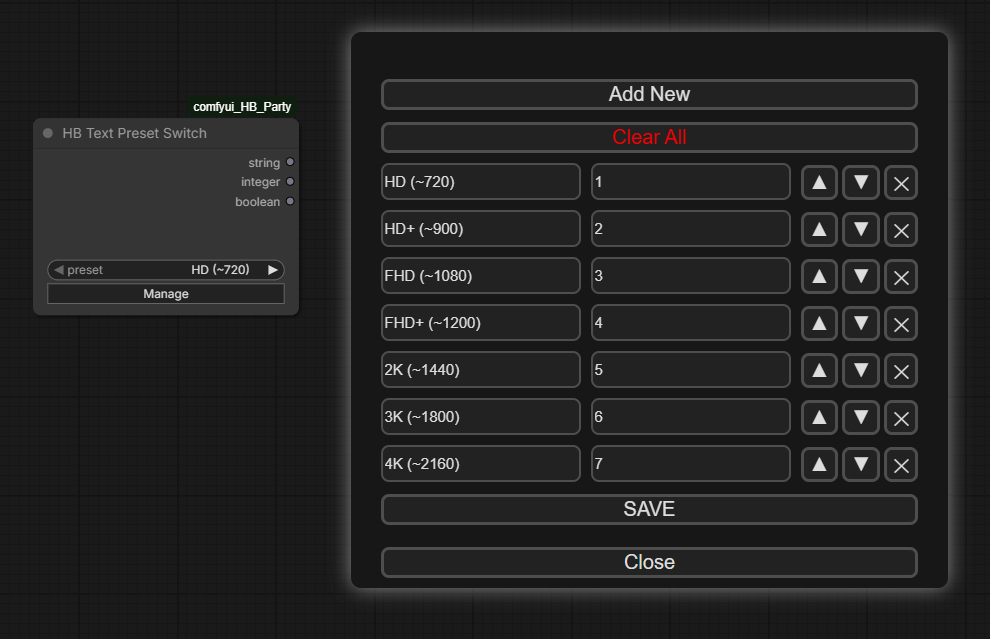
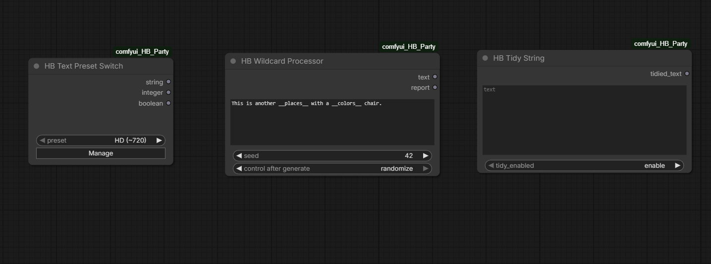

# HB ComfyUI Nodes

A collection of utility nodes for ComfyUI focused on:

- advanced wildcard processing
- prompt cleanup
- dynamic preset systems
- workflow-friendly UI utilities
- reusable text pipeline tools

---

# Current Version

v1.0.1

---

# HB Text Preset Switch



Dynamic preset dropdown system designed for:
- reusable workflows
- App Mode interfaces
- prompt switching
- resolution/profile selection
- reusable pipeline controls

## Features

- Editable preset management UI
- Workflow-local persistence
- Undo-safe restoration
- Refresh-safe restoration
- Node 2.0 compatibility
- Sortable preset ordering
- Hidden internal storage system
- App Mode label persistence
- Dynamic dropdown rebuilding

## Outputs

- STRING
- INT
- BOOLEAN

---

# HB Nodes Overview



---

# Included Nodes

## HB Wildcard Processor

Advanced wildcard parsing system with:

- recursive inline wildcards
- weighted random syntax
- subfolder wildcard support
- file-based wildcard systems
- wildcard report generation
- deterministic seed behavior

### Supported Features

- Recursive wildcard parsing
- Nested weighted syntax
- File wildcard loading
- Locked wildcard reuse
- Multi-line wildcard selection
- Subfolder wildcard resolution

---

## HB Tidy String

Utility node focused on:
- cleaning prompts
- fixing comma spacing
- removing formatting artifacts
- newline cleanup
- prompt normalization

Useful for:
- Stable Diffusion prompts
- wildcard pipelines
- generated text cleanup
- reusable prompt workflows

---

## HB Text Preset Switch

Dynamic editable dropdown node with:
- editable presets
- sortable entries
- workflow persistence
- Node 2.0 support
- App Mode compatibility
- multi-output conversion

Designed to avoid:
- Python validation conflicts
- workflow reset issues
- dropdown persistence bugs

---

# Installation

## ComfyUI Manager

Use:

```txt
https://github.com/HassanEclipse/comfyui-hb-party
```

inside:

```txt
Manager → Install via Git URL
```

---

## Manual Installation

Clone into:

```txt
ComfyUI/custom_nodes/
```

Example:

```txt
ComfyUI/custom_nodes/comfyui_HB_Party
```

Then restart ComfyUI.

---

# Example Workflows

Example workflows are included inside:

```txt
/examples
```

---

# Documentation

Detailed documentation available in:

```txt
/docs
```

Files:

- docs/wildcard_processor.md
- docs/tidy_string.md
- docs/text_preset_switch.md
- docs/CHANGELOG.md

---

# Package Goals

This package was designed with:

- workflow portability
- reusable text systems
- App Mode compatibility
- Node 2.0 support
- workflow-safe persistence
- dynamic UI systems
- lightweight utility workflows

in mind.

---

# License

MIT License